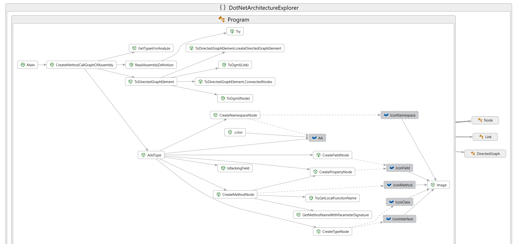

# DotNet Architecture Explorer [Download](https://github.com/beyaz/DotNetArchitectureExplorer/raw/master/DotNetArchitectureExplorer.7z)

Extracts method call graph and type dependency to dgml file.

Select any .net assembly then drag and drop on DotNetArchitectureExplorer.exe

Then output dgml file automatically will be create.

## Screenshot

